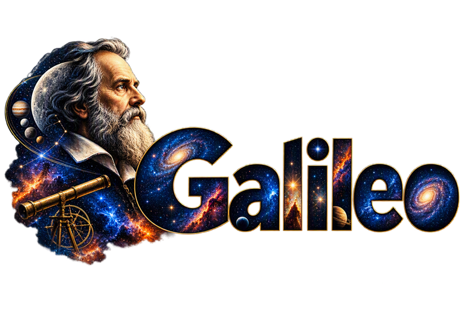

# Galileo




A cross-platform astrophotography imaging application for Windows, macOS, and Linux — built on [INDI](https://indilib.org/) and [ASCOM Alpaca](https://ascom-standards.org/AlpacaDeveloper/) instead of Windows-only ASCOM/COM device drivers.

## Why Galileo

Two things motivate this project:

1. **Non-Windows imaging software has a UI/UX gap.** Existing cross-platform options (KStars/EKOS chief among them) have interfaces that have aged over a decade or more of incremental growth. Galileo aims to bring a modern, guided imaging workflow to Windows, macOS, and Linux alike, using INDI and ASCOM Alpaca so it isn't tied to any one platform's device-driver ecosystem.
2. **Consolidating prior work into one cohesive application.** Galileo's author has built several separate astronomy tools over time — an image manager, a variable-star planner, observatory-automation scripts, an all-sky cloud-detection classifier. Bringing that scattered work together into a single application, rather than maintaining it as several disconnected tools, is a primary goal of this project, not an afterthought.

## Status

**Pre-alpha — early development.** Galileo is a runnable PySide6 desktop application today, not just a design document, but most of its screens are still placeholders pending their own build-out.

- **Design docs**: a complete Project Scope Document, a Software Requirements Specification (235 numbered requirements across 27 functional domains and 9 non-functional domains), a Software Design Description covering the full planned architecture, and a Requirements Traceability Matrix at 100% coverage.
- **Automated tests**: 244 passing (plus a handful of soak/hardware/installer-artifact tests that are intentionally skipped outside a real overnight/CI run) covering every SRS domain — see [Running the tests](#running-the-tests).
- **What's working today**:
  - A dark-themed, N.I.N.A.-style shell — a primary icon sidebar (Equipment, Sky Atlas, Framing, Flat Wizard, Sequence, Imaging, Scheduler, Library, Variable Stars, Options) plus a context-sensitive second panel per section, a top-bar Observatory/Pier selector, and a status bar.
  - **Equipment**: per-device-category (Camera, Mount, Filter Wheel, Focuser, Rotator, Guider, Switch, Flat Panel, Weather, Dome, Safety Monitor) Driver/Server/Port connection panels that do a real INDI or Alpaca scan against a live device — including Alpaca Management API discovery and `.local` mDNS hostname resolution (e.g. a Seestar's `seestar.local` bridge).
  - **Observatory/Pier**: persisted master records (name, lat/long, timezone, physical address, owner for Observatories; name for Piers) saved to a local SQLite database via Peewee, selectable/creatable from the top bar, surviving restarts.
  - **Sky Atlas**: a real search-criteria panel wired to the catalog search/filter backend.
  - **Framing**: a real target/mosaic input panel wired to the FOV and mosaic-panel calculator.
  - **Logging**: a runtime logging service capturing all application output to a datestamped, per-run-reset log file under `logs/`, plus a live scrolling log tail on every Equipment device screen.
- **Still placeholder UI**: Sequencer, Imaging, Scheduler, Library, Variable Stars, Flat Wizard, and Options currently show a "not implemented yet" stub — the domain-core logic behind several of them (e.g. `galileo.library`, `galileo.vstarget.*`, `galileo.scheduler`) already exists and is tested, it just isn't wired to a screen yet.

The `VST`/`VST-AN` plugins specified in the SDD remain the planned reference implementation of Galileo's plugin architecture (`PLUG`), not yet built as installable plugins.

## Getting Started

Requires Python 3.11+.

```bash
python -m venv .venv
# Windows:
.venv\Scripts\pip install -r requirements.txt
# macOS/Linux:
.venv/bin/pip install -r requirements.txt

./run.sh        # macOS/Linux, or Git Bash on Windows
.\run.ps1       # Windows PowerShell
```

Both launch scripts locate the project's `.venv` automatically and start the app maximized. `requirements-dev.txt` additionally installs `pytest`/`ruff`/`mypy` for development.

### Running the tests

```bash
pytest                                                       # full suite
pytest -m "not soak and not hardware and not integration"    # skip long/external-dependency tests
```

## Documentation

| Document | Contents |
|---|---|
| [`docs/PSD.md`](docs/PSD.md) — Project Scope Document | Goals, non-goals, functional/non-functional requirement domains, constraints, risks |
| [`docs/SRS.md`](docs/SRS.md) — Software Requirements Specification | Numbered, testable requirements decomposed from the PSD |
| [`docs/SDD.md`](docs/SDD.md) — Software Design Description | Architecture, module-by-module design, and the design decisions (ADRs) behind it |
| [`docs/RTM.md`](docs/RTM.md) — Requirements Traceability Matrix | Every SRS requirement mapped to its SDD component and a reserved test-case ID; generated from the SRS/SDD text, 100% coverage |

## Planned Capabilities

- **Equipment control** for cameras, mounts, filter wheels, focusers, rotators, guiders, domes, and safety/weather monitors, via INDI or ASCOM Alpaca only — mixed freely within one setup, with no bypass even for software-computed signals: a hardware rain sensor (Tier 1) and an ML-based cloud classifier (Tier 2) both connect as ordinary INDI/Alpaca Safety Monitor devices
- **Guided imaging** with a basic sequencer and an advanced instruction/condition/trigger sequencer
- **Sky navigation**: a catalog-based Sky Atlas, a Framing Assistant, and a live interactive planetarium-style Sky Map
- **Autofocus, plate solving, automated meridian flip, and external-guider integration**
- **A multi-night observatory Scheduler** with altitude/moon/twilight/horizon constraints and weather-gated execution
- **Multi-mount observatory management**: one Galileo instance coordinating several independent telescopes ("Piers"), with shared or per-telescope dome/safety scoping — deliberately going beyond what EKOS itself supports
- **An image library and repository manager**: cataloging, deduplication, smart-telescope ingestion, master calibration-frame creation/application, quality metrics, live auto-registration of frames during acquisition into sequence-scoped session containers, and command-line batch utilities for scanning/sync
- **A variable-star workflow**: AAVSO target planning and photometric analysis/reporting, delivered as pre-loaded first-party plugins that are a peer to the Sky Atlas when enabled — including submitting a target straight into the Scheduler from the plugin's own UI
- **Layered safety monitoring**: any connected Safety Monitor device — hardware (Tier 1) or software-computed (Tier 2) — trusted for automated aborts, with an independent crash/hang watchdog
- **An extensible plugin architecture**: first-party plugins (pre-loaded, individually enabled/disabled, functionally equivalent to core when on) alongside a third-party plugin manager
- **FITS-primary image I/O**, including required tile-compressed FITS — XISF is accepted on import and converted best-effort to FITS, but never used as Galileo's own output/working format

See the [PSD](docs/PSD.md) for the full requirement domain list and what's explicitly out of scope for v1.

## Built On

Galileo consolidates and builds on several of the author's existing projects:

- [AstroFiler](https://github.com/gordtulloch/astrofiler-gui) — image cataloging and calibration processing (merged in full)
- [VSTarget](https://github.com/gordtulloch/VSTarget) — AAVSO variable-star planning and photometry (merged in full)
- [Obsy](https://github.com/gordtulloch/obsy) — target-visibility and sky-survey-thumbnail logic (retired as an app, its GPL-3.0 code ported directly into the Sky Atlas/Framing Assistant)
- [AstroLlama](https://github.com/gordtulloch/AstroLlama) and [MCP](https://github.com/gordtulloch/MCP) — selectively harvested for specific device-abstraction and safety-sensor functionality

See the PSD's Background section for the full picture of what's merged, harvested, or kept as reference only, and why.

## Tech Stack

Python 3 with [PySide6](https://doc.qt.io/qtforpython/) (Qt for Python), chosen for native rendering performance on ARM SBCs — including Raspberry Pi 5-class hardware running Debian, a first-class target platform, not just a theoretical one — and direct reuse of the existing Python astronomy ecosystem (`astropy`, `peewee`, `zeroconf`). See [SDD Section 2.1](docs/SDD.md) for the full rationale. The INDI and Alpaca adapters currently implement their own lightweight clients directly (raw sockets / `httpx`+`urllib`) rather than depending on `pyindi-client`/`alpyca`, which remain optional in `pyproject.toml` for a future switch.

**On the GIL:** people considering Python for a desktop imaging app reasonably ask about the Global Interpreter Lock. Two things address it here. First, UI responsiveness isn't a GIL question at all — PySide6 renders through Qt's native C++ widget engine regardless of what the interpreter is doing, the same as a C++/Qt build. Second, the CPU-bound work that actually matters (star detection, HFR curve fitting during autofocus) is dispatched to a `ProcessPoolExecutor` rather than run on the main thread, so it doesn't contend with the UI for the GIL in the first place; `numpy`/`astropy`, which do most of the heavy lifting either way, already release the GIL internally for the bulk of their work. See [SDD §2.1](docs/SDD.md)'s accepted-risks table for the full reasoning.

## Reference Test Environment

Galileo's design is validated against the author's own physical multi-Pier Observatory, not a hypothetical one: a roll-off-roof shed ([indi-rolloffino](https://github.com/wotalota/indi-rolloffino)), an INDI weather station ([indi-argentweather](https://github.com/gordtulloch/indi-argentweather)) and rain monitor ([indi-hydreon](https://github.com/gordtulloch/indi-hydreon)), and two independent Piers — a Seestar S30 and a Seestar S30 Pro, both connected via ASCOM Alpaca. See [PSD Section 6.8](docs/PSD.md) for details.

## License

[GPL-3.0](LICENSE)

## Author

[Gord Tulloch](https://github.com/gordtulloch)
