# Galileo

A cross-platform Python-based astrophotography imaging application for Windows, macOS, and Linux — built on [INDI](https://indilib.org/) and [ASCOM Alpaca](https://ascom-standards.org/AlpacaDeveloper/) Supports a mix of INDI and Alpaca devices on multiple piers per observatory, multiple optical tubes and cameras per mount.  

## Why Galileo

Two things motivate this project:

1. **Non-Windows imaging software has a UI/UX gap.** Existing cross-platform options (KStars/EKOS chief among them) have interfaces that have aged over a decade or more of incremental growth. Galileo aims to bring a modern, guided imaging workflow to any platform from Windows to Linux to Mac to Raspberry Pi, using INDI and ASCOM Alpaca so it isn't tied to any one platform's device-driver ecosystem.
2. **Consolidating prior work into one cohesive application.** Galileo's author has built several separate astronomy tools over time — an image manager, a variable-star planner, observatory-automation scripts, an all-sky cloud-detection classifier. Bringing that scattered work together into a single application, rather than maintaining it as several disconnected tools, is a primary goal of this project, not an afterthought.

## Status

**Pre-alpha — early development.** Galileo is a runnable PySide6 desktop application today, not just a design document, but some of its screens are still placeholders pending their own build-out.  Download it and give it a try today! HOWEVER DO NOT USE FOR PRODUCTION PURPOSES.

- **Design docs**: a complete Project Scope Document, a Software Requirements Specification (272 numbered requirements across 27 functional domains and 9 non-functional domains), a Software Design Description covering the full planned architecture, and a Requirements Traceability Matrix at 100% coverage.
- **Automated tests**: 639 passing (plus 1 skipped and 6 soak/hardware/integration tests deselected outside a real overnight/CI run, out of 646 collected) covering every SRS domain — see [Running the tests](#running-the-tests).
- **What's working today**:
  - A dark-themed shell — a primary icon sidebar (Equipment, Star Atlas, Planning, Framing, Imaging, Guiding, Focus, Solve, Library, Science, Options — with Planning opening onto Targets, Sequence and Scheduler, and Science onto Variable Stars) plus a context-sensitive second panel per section, a top-bar Observatory/Pier selector, and a status bar.
  - **Guiding** (its own sidebar section, below Imaging): connects to PHD2 by host and port and shows its live state — guide-star image, guide graph, drift and calibration plots, guide statistics and event log — with Loop/Guide/Stop/Dither/exposure controls.
  - **Focus** (its own sidebar section, below Guiding): follows an autofocus run live — the frame being measured, star count / HFR / FWHM, and the HFR V-curve with its fit and best position — and only updates while a run is in progress, whether started by its own Auto Focus button or by another part of the app. Start/Stop, step size, points and exposure work; Aberration Inspector, CFZ and Advisor buttons are placeholders.
  - **Solve** (its own sidebar section, below Focus): plate solving with the frame being solved and its results on show. **Capture & Solve** takes an exposure with the selected camera and solves it with ASTAP (using the mount's position as a search hint), then syncs the mount, slews back to the target until within an accuracy you set, or just reports the error; **Load & Slew…** solves a FITS file and slews to it; **Stop** cancels. It shows every solve, whichever part of Galileo started it, and only updates while it is in view. Needs [ASTAP](https://www.hnsky.org/astap.htm) and a star database installed (found on `PATH` or in its usual install folder). ASTAP is the only solver; Polar Alignment coming soon.
  - **Equipment**: per-device-category (Camera, Mount, Filter Wheel, Focuser, Rotator, Switches, Flat Panel, Weather, Dome, Safety Monitor) Driver/Server/Port connection panels that do a real INDI or Alpaca scan against a live device — including Alpaca Management API discovery and `.local` mDNS hostname resolution (e.g. a Seestar's `seestar.local` bridge).
  - **Observatory/Pier**: persisted master records (name, lat/long, timezone, physical address, owner for Observatories; name for Piers) saved to a local SQLite database via Peewee, selectable/creatable from the top bar, surviving restarts.
  - **Star Atlas**: a basic planetarium — stars, deep-sky objects (Messier, Caldwell and NGC catalogs, chosen with the panel's Catalogs **+** button), Sun/Moon/planets for the Observatory's location and a chosen (or live) time, with optional constellation boundaries and constellation outlines (stick figures), pan/zoom, click-to-identify and centre-and-track. A horizon obstruction table can be uploaded under **Options > Star Atlas** and shaded on the map with the **Horizon** checkbox; **Options > Planning** can then refuse slews into it. Each Pier in the Observatory gets a labelled telescope reticle (the **Telescope markers** checkbox) that sits where its mount is pointing and travels across the sky as the mount slews, with a dotted line to the target it is heading for. No comets/satellites, and no FOV rectangle yet.
  - **Planning** (formerly Sky Atlas): a real search-criteria panel wired to the catalog search/filter backend.
  - **Framing**: a real target/mosaic input panel wired to the FOV and mosaic-panel calculator.
  - **Imaging**: a live, pan/zoomable auto-stretch preview (`QGraphicsView`) with a histogram, per-frame statistics (mean/median/min/max/star count/HFR), manual single-exposure capture run off the UI thread with a live countdown, an independent Save Frame action, a portrait/landscape layout that follows the frame (the preview narrows to a third of the width and the nudge pad, histogram and log move to its left for a portrait frame, with a manual override), a N/S/E/W mount nudge pad for the connected mount, and a per-Pier current object (picked in the Star Atlas, shown top right) that names saved frames and is what Solve's Slew to Target slews to, a Quantity/Gain pair that takes a run of frames and files each one straight into the Library, and a Live Stack option that registers and combines a run into one image as it is taken, saveable to the Library or a file. Every frame it writes is saved in a FITS sample format other astronomy software can actually read, no 64-bit images, with an Options > Imaging screen to fix that format if the automatic choice isn't what you want.
  - **Library** (AstroFiler's screens, in its own sidebar section): **Images** (the catalog by object), **Sessions** (imaging sessions, linked calibration sessions, master frames, calibrating lights), **Mappings** (FITS header-value rules), **Dedup** (duplicate files), **Merge Objects** (rename an object across the catalog) and **Cloud** (Google Cloud Storage backup and sync). Its settings are under **Options > Library**. The catalog lives in the same database as everything else, built by migrations, and an existing AstroFiler database opens as it is. AstroFiler's twelve command-line utilities are installed as `galileo-load-repo`, `galileo-create-sessions`, `galileo-link-sessions`, `galileo-auto-calibration`, `galileo-cloud-sync` and so on, for scheduled or headless use.
  - **Logging**: a runtime logging service capturing all application output to a datestamped, per-run-reset log file under `logs/`, plus a live scrolling log tail on every Equipment device screen ala KStars.
- **Still placeholder UI**: Sequencer, Scheduler, Variable Stars, and every Options page except Library, Star Atlas and Planning currently show a "not implemented yet" stub — the domain-core logic behind several of them (e.g. `galileo.plugins.vstarget.*`, `galileo.scheduler`) already exists and is tested, it just isn't wired to a screen yet.

The `VST`/`VST-AN` plugins specified in the SDD remain the planned reference implementation of Galileo's plugin architecture (`PLUG`), not yet built as installable plugins.

## Getting Started

Please see the Wiki for the Getting Started Guide.

## Documentation

| Document | Contents |
|---|---|
| [`docs/PSD.md`](docs/PSD.md) — Project Scope Document | Goals, non-goals, functional/non-functional requirement domains, constraints, risks |
| [`docs/SRS.md`](docs/SRS.md) — Software Requirements Specification | Numbered, testable requirements decomposed from the PSD |
| [`docs/SDD.md`](docs/SDD.md) — Software Design Description | Architecture, module-by-module design, and the design decisions (ADRs) behind it |
| [`docs/RTM.md`](docs/RTM.md) — Requirements Traceability Matrix | Every SRS requirement mapped to its SDD component and a reserved test-case ID; generated from the SRS/SDD text, 100% coverage |

## Planned Capabilities

- **Equipment control** for cameras, mounts, filter wheels, focusers, rotators, guiders, domes, and safety/weather monitors, via INDI or ASCOM Alpaca only — mixed freely within one setup, with no bypass even for software-computed signals: a hardware rain sensor (Tier 1) and an ML-based cloud classifier (Tier 2) both connect as ordinary INDI/Alpaca Safety Monitor devices
- **Guided imaging** with a basic sequencer and an advanced instruction/condition/trigger sequencer
- **Sky navigation**: a catalog-based Sky Atlas, a Framing Assistant, and a live interactive planetarium-style Sky Map
- **Autofocus, plate solving, automated meridian flip, and external-guider integration**
- **A multi-night observatory Scheduler** with altitude/moon/twilight/horizon constraints and weather-gated execution
- **Multi-mount observatory management**: one Galileo instance coordinating several independent telescopes ("Piers"), with shared or per-telescope dome/safety scoping — deliberately going beyond what EKOS itself supports
- **An image library and repository manager**: cataloging, deduplication, smart-telescope ingestion, master calibration-frame creation/application, quality metrics, live auto-registration of frames during acquisition into sequence-scoped session containers, and command-line batch utilities for scanning/sync
- **A variable-star workflow**: AAVSO target planning and photometric analysis/reporting, delivered as pre-loaded first-party plugins that are a peer to the Sky Atlas when enabled — including submitting a target straight into the Scheduler from the plugin's own UI
- **Layered safety monitoring**: any connected Safety Monitor device — hardware (Tier 1) or software-computed (Tier 2) — trusted for automated aborts, with an independent crash/hang watchdog
- **An extensible plugin architecture**: first-party plugins (pre-loaded, individually enabled/disabled, functionally equivalent to core when on) alongside a third-party plugin manager
- **FITS-primary image I/O**, including required tile-compressed FITS — XISF is accepted on import and converted best-effort to FITS, but never used as Galileo's own output/working format

See the [PSD](docs/PSD.md) for the full requirement domain list and what's explicitly out of scope for v1.

## Built On

Galileo consolidates and builds on several of the author's existing projects:

- [AstroFiler](https://github.com/gordtulloch/astrofiler-gui) — image cataloging and calibration processing (merged in full)
- [VSTarget](https://github.com/gordtulloch/VSTarget) — AAVSO variable-star planning and photometry (merged in full)
- [Obsy](https://github.com/gordtulloch/obsy) — target-visibility and sky-survey-thumbnail logic (retired as an app, its GPL-3.0 code ported directly into the Sky Atlas/Framing Assistant)
- [AstroLlama](https://github.com/gordtulloch/AstroLlama) and [MCP](https://github.com/gordtulloch/MCP) — selectively harvested for specific device-abstraction and safety-sensor functionality

See the PSD's Background section for the full picture of what's merged, harvested, or kept as reference only, and why.

## Tech Stack

Python 3 with [PySide6](https://doc.qt.io/qtforpython/) (Qt for Python), chosen for native rendering performance on all platforms including ARM SBCs and direct reuse of the existing Python astronomy ecosystem (`astropy`, `peewee`, `zeroconf`). See [SDD Section 2.1](docs/SDD.md) for the full rationale.

**On the GIL:** people considering Python for a desktop imaging app reasonably ask about the Global Interpreter Lock. Two things address it here. First, UI responsiveness isn't a GIL question at all — PySide6 renders through Qt's native C++ widget engine regardless of what the interpreter is doing, the same as a C++/Qt build. Second, the CPU-bound work that actually matters (star detection, HFR curve fitting during autofocus) is dispatched to a `ProcessPoolExecutor` rather than run on the main thread, so it doesn't contend with the UI for the GIL in the first place; `numpy`/`astropy`, which do most of the heavy lifting either way, already release the GIL internally for the bulk of their work. See [SDD §2.1](docs/SDD.md)'s accepted-risks table for the full reasoning.

## Reference Test Environment

Galileo's design is validated against the author's own physical multi-Pier Observatory: a roll-off-roof shed ([indi-rolloffino](https://github.com/wotalota/indi-rolloffino)), an INDI weather station ([indi-argentweather](https://github.com/gordtulloch/indi-argentweather)) and rain monitor ([indi-hydreon](https://github.com/gordtulloch/indi-hydreon)), and two independent Piers — a Seestar S30 and a Seestar S30 Pro, both connected via ASCOM Alpaca. See [PSD Section 6.8](docs/PSD.md) for details.

## License

Copyright (C) 2025-2026 Gord Tulloch. Licensed under [GPL-3.0-or-later](LICENSE). Every source file carries an `SPDX-License-Identifier` and copyright header.

## Contributing

Contributions are welcome. All contributors must agree to the Contributor License Agreement (CLA) in [CONTRIBUTING.md](CONTRIBUTING.md), which also covers the development setup, test conventions and changelog requirements.

## Author

[Gord Tulloch](https://github.com/gordtulloch)

## Screenshots

### Equipment

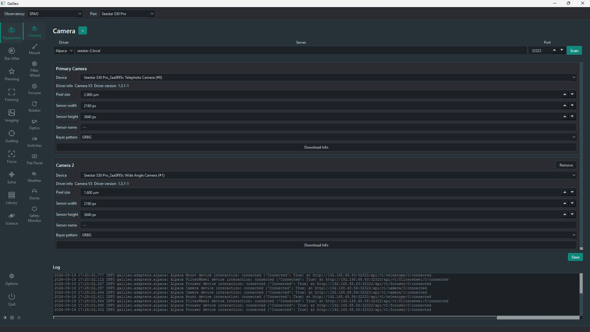

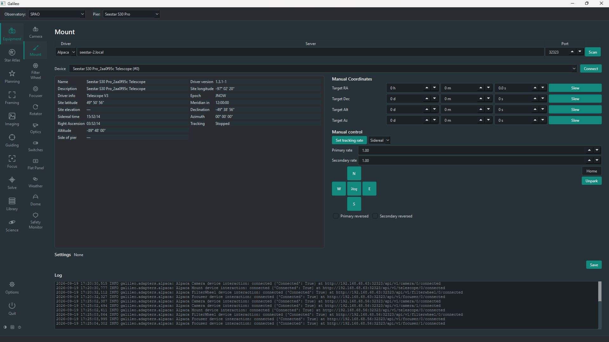

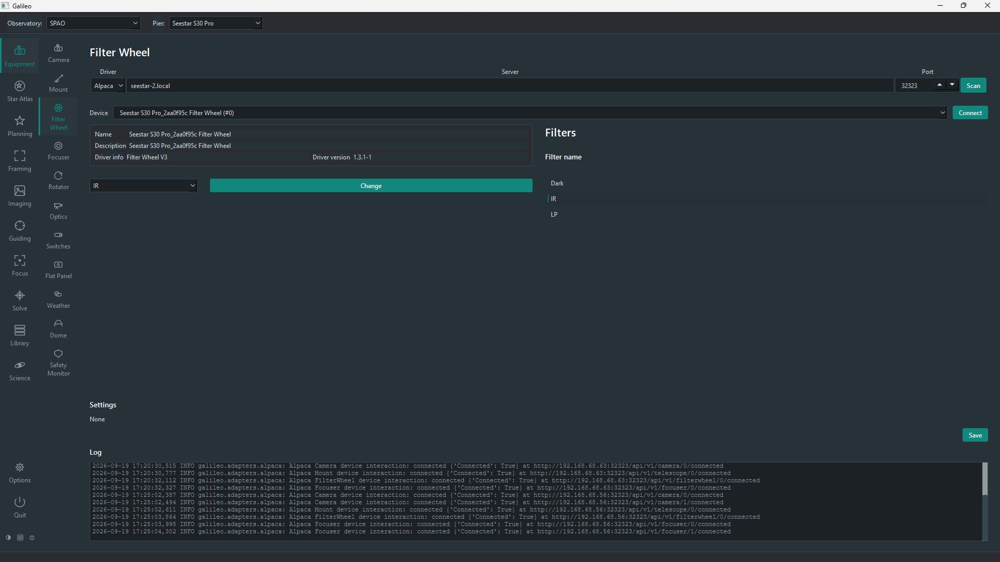

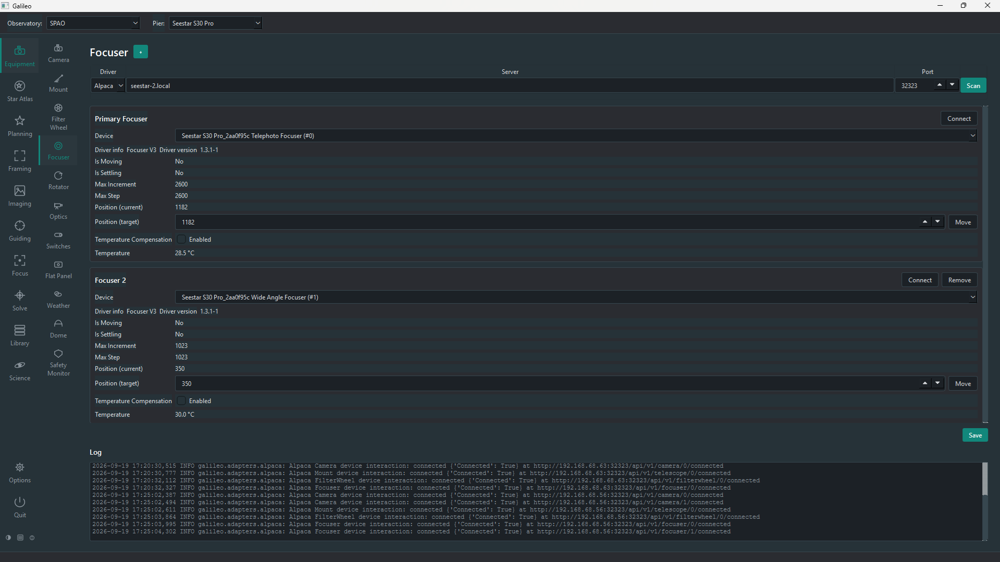

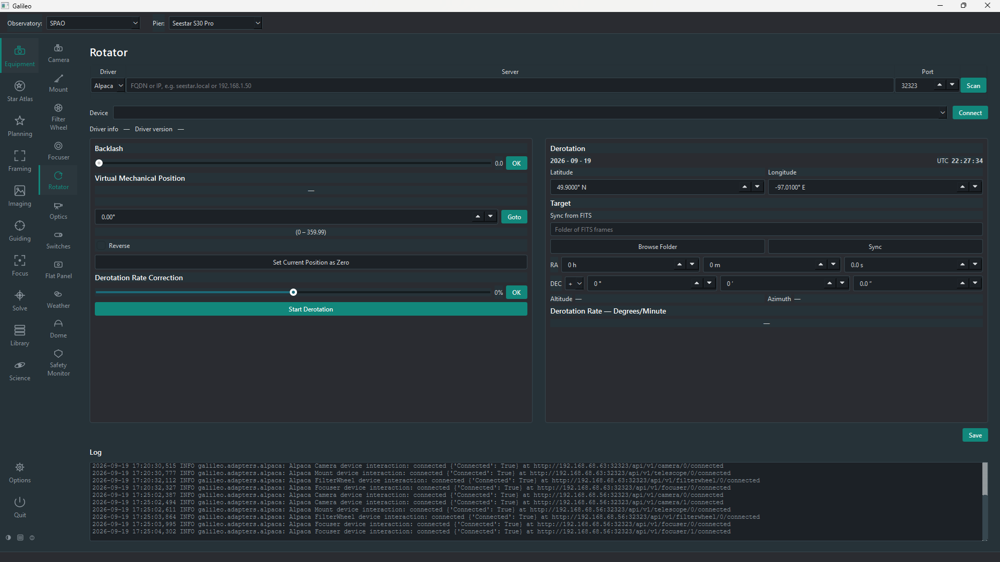

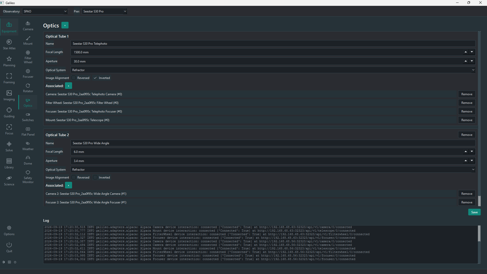

### Imaging

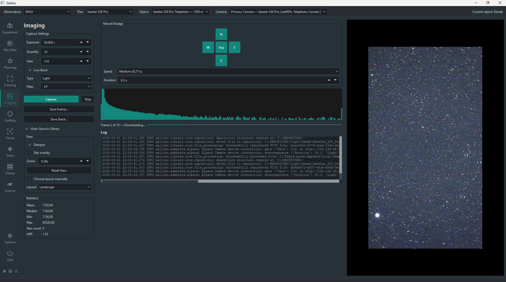

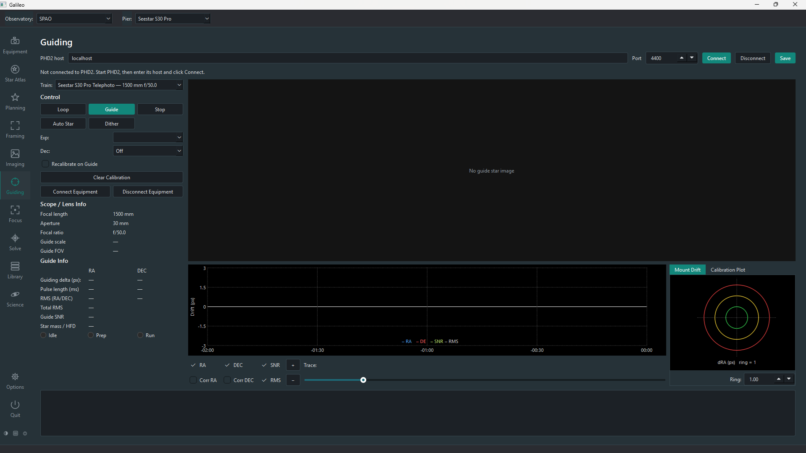

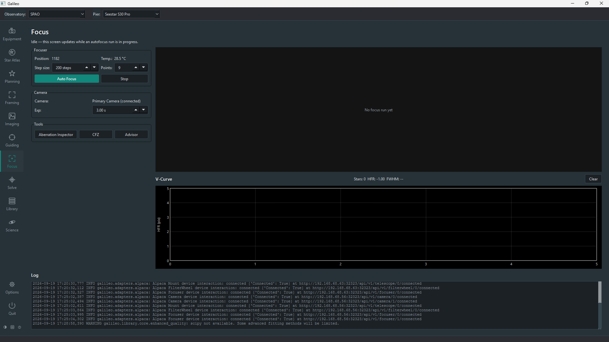

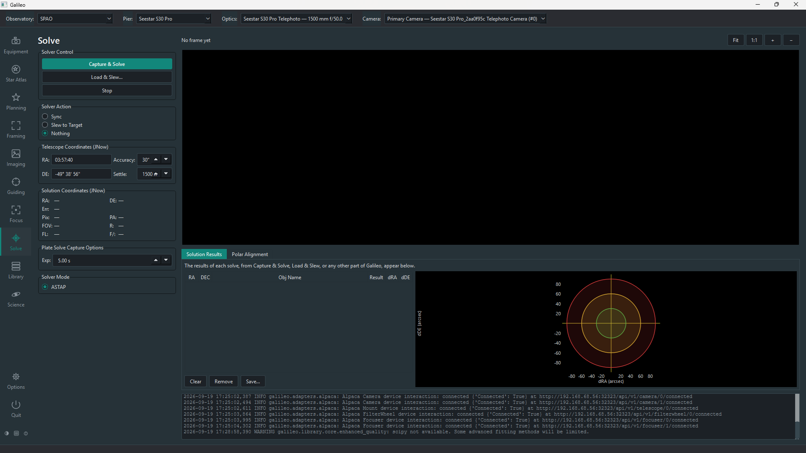

### Planning and Library

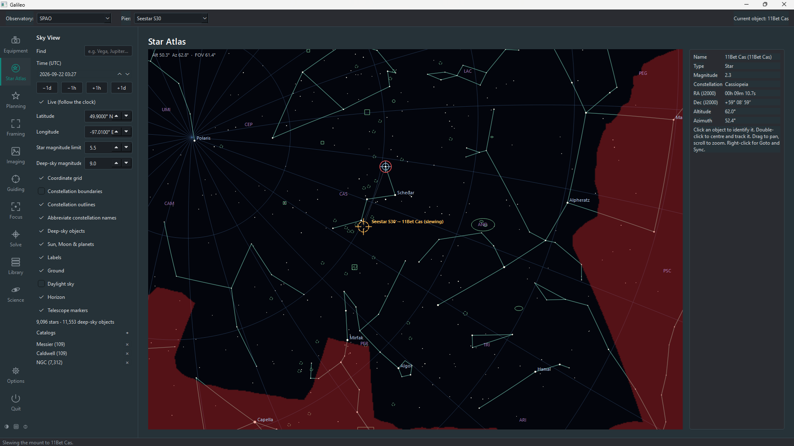

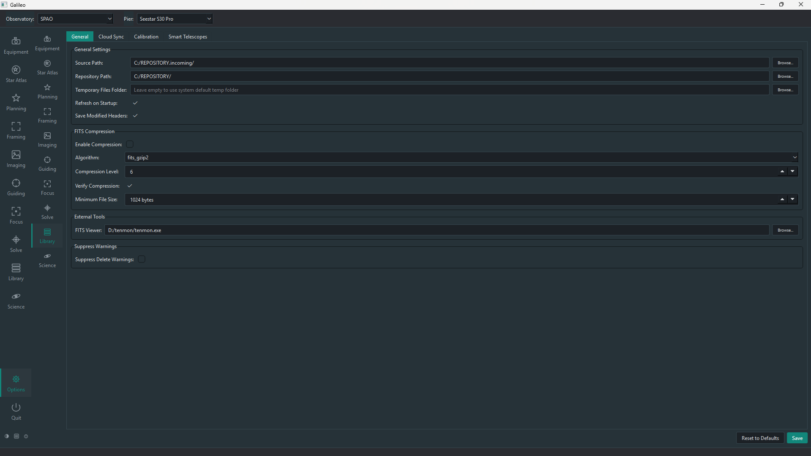
